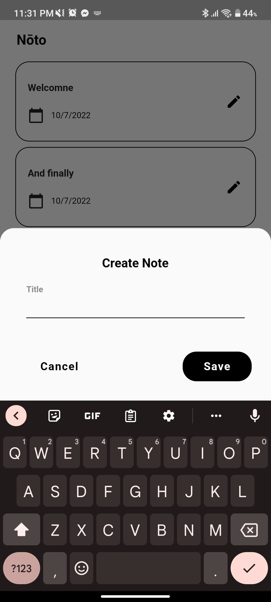
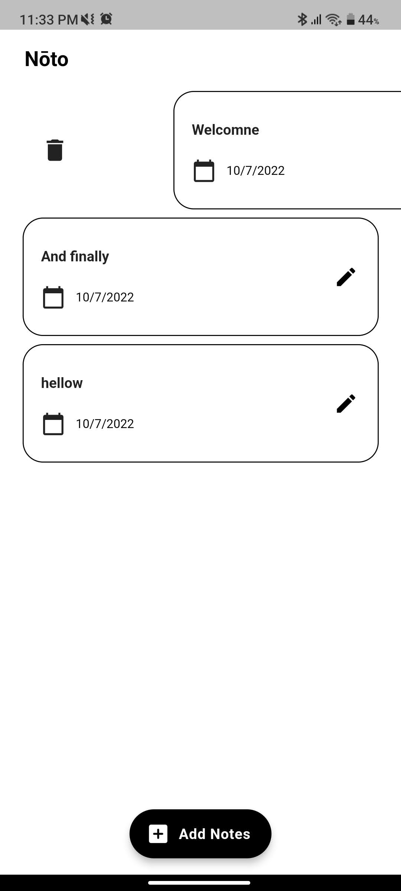

# Consuming Notes API Exercise

UI is recycled from my previews project Tasuku but backend is implemented with Notes API

Tasuku: https://github.com/martinericksonn/Tasuku-Todo-App  
API: https://tq-notes-api-jkrgrdggbq-el.a.run.app  
Tutorial: https://www.youtube.com/playlist?list=PL_Wj0DgxTlJeLFYfRBfpFveEd9cQfIpDx

|                                                           |                                                    |
| :-------------------------------------------------------: | :------------------------------------------------: |
|  |  |
